# Allweather-Denoising
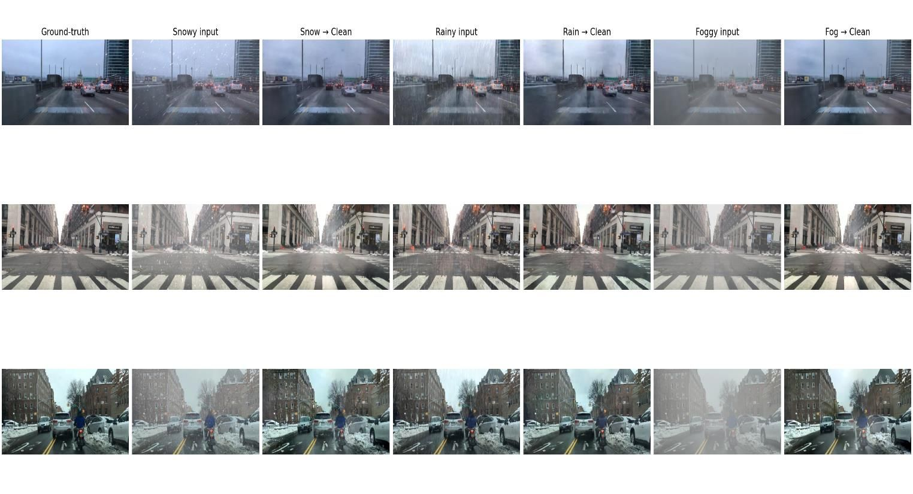

## Introduction
Adverse weather conditions can significantly degrade object detection performance in autonomous driving systems, leading to unreliable model decisions. This project addresses that problem by developing a **patch-based diffusion model** oriented image restoration filter designed to remove weather-related degradations from vehicle camera images.


## Dataset Construction
To keep the scope aligned with autonomous driving applications and improve model relevance, the study focuses exclusively on **in-vehicle camera data**. For snowy conditions, [VideoDesnowing](https://github.com/haoyuc/VideoDesnowing) dataset was used as the foundation. From this dataset, **22 distinct driving scenarios** were separated, each containing different environmental settings, camera perspectives, and in-car visual compositions. Based on the clean reference images, additional **synthetic adverse-weather dataset** was generated. Rainy images were synthesized using two distinct rain-generation models. [SyRaGAN](https://github.com/jaewoong1/SyRa-Synthesized_Rain_dataset) was applied to generate rain streaks with varying directions and densities without losing the consistency between streaks, while [VRGNet](https://github.com/hongwang01/VRGNet) was used to produce the broader atmospheric rain appearance at different density levels. Foggy images were generated using [FINet](https://github.com/zhangzhengde0225/FINet) under varying depth and density settings. The resulting dataset was further augmented through **[augmentation methods]** to increase sample diversity and improve the robustness and generalization performance of the model.

## Dataset Samples

<table>
  <tr>
    <th>Scene</th>
    <th>Ground Truth Image</th>
    <th>Snowy Weather</th>
    <th>Rainy Weather</th>
    <th>Foggy Weather</th>
  </tr>
  
  <tr>
    <td>Scene-1</td>
    <td>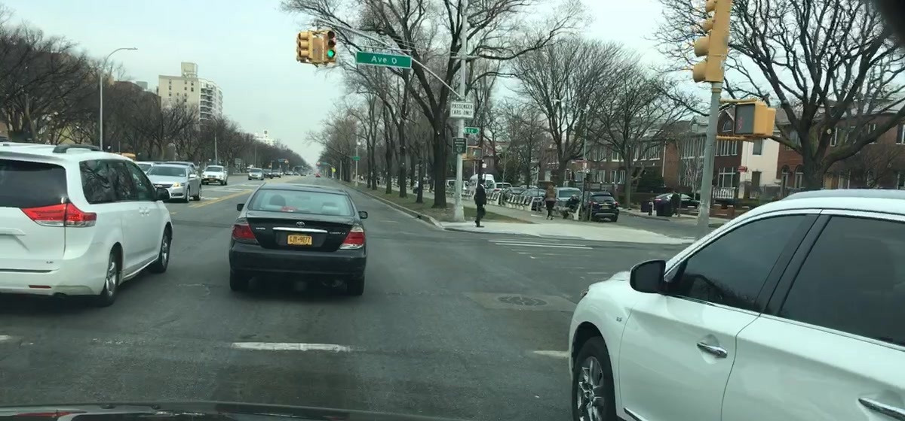</td>
    <td>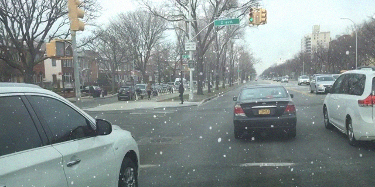</td>
    <td>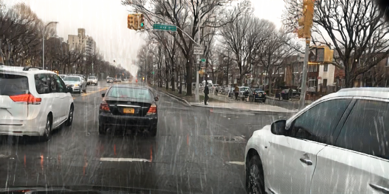</td>
    <td>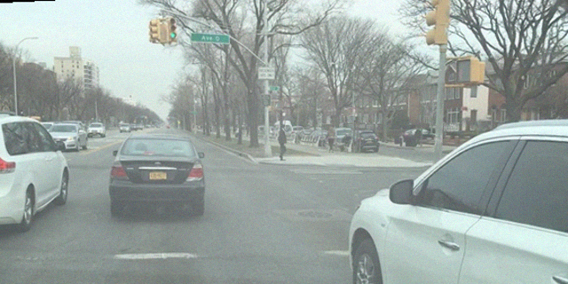</td>
  </tr>
  
  <tr>
    <td>Scene-2</td>
    <td>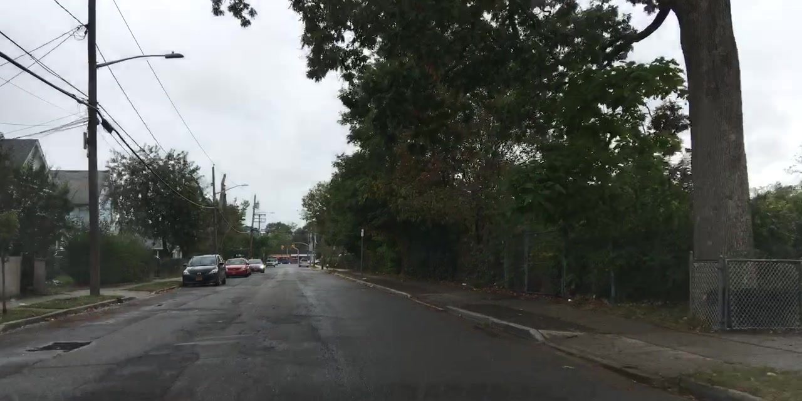</td>
    <td>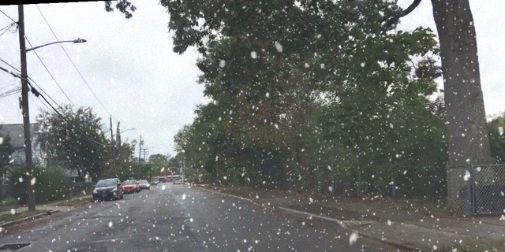</td>
    <td>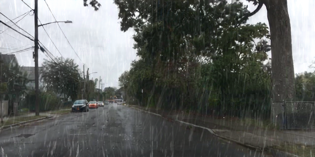</td>
    <td>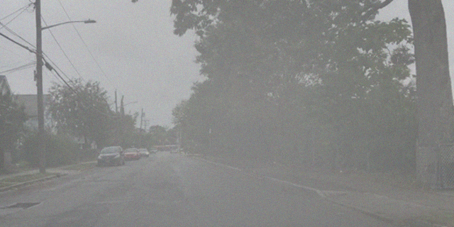</td>
  </tr>
  
  <tr>
    <td>Scene-3</td>
    <td>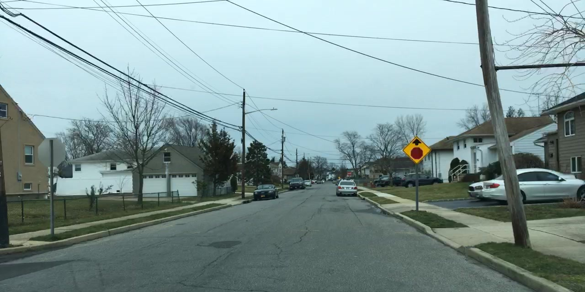</td>
    <td>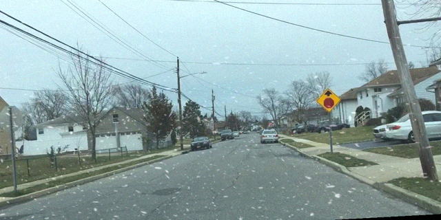</td>
    <td>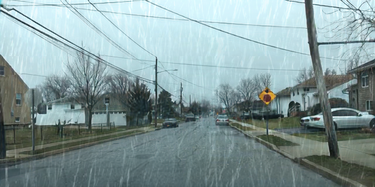</td>
    <td>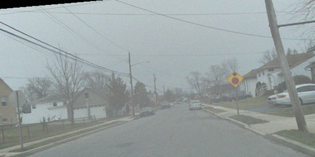</td>
  </tr>
</table>


## Dataset Structure

| Weather Condition | Training Sample | Training Scenes | Test Sample | Test Scenes|
|---|---:|---:|---:|---:|
| Snow | 1956 | 19 | 600 | 3 |
| Rain | 1956 | 19 | 600 | 3 |
| Fog | 1956 | 19 | 600 | 3 |


## Model Training

The resulting synthetic dataset, covering snow, rain, and fog, was used to train a patch-based diffusion model for adverse weather removal. The training split for each weather condition contains 1,956 images from 19 scenarios, while the test split contains 600 images from 3 unseen scenarios. This scenario-based separation enables evaluation under previously unseen environmental conditions, camera viewpoints, and vehicle-interior contexts, providing a more realistic measure of model generalization.

## Model Architecture

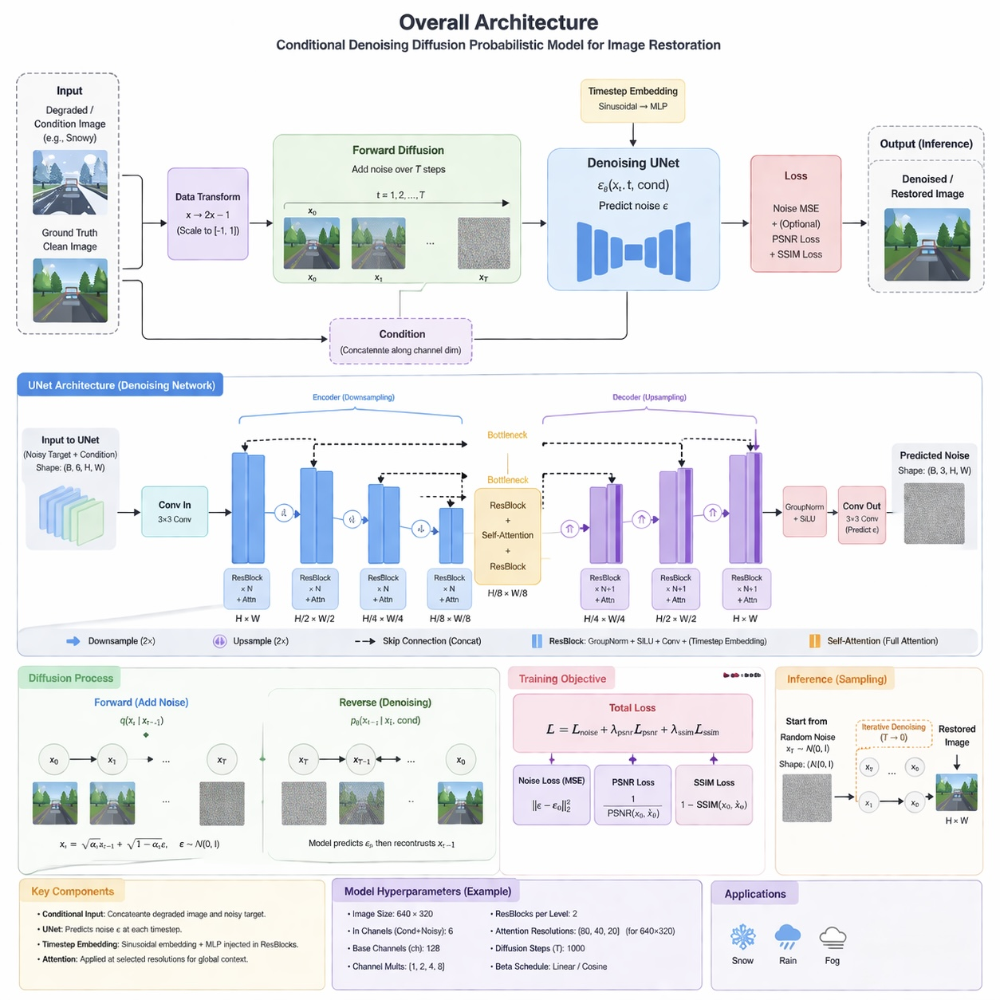

## Implementation

This project implements a deep learning-based adverse weather removal pipeline designed for vehicle-camera imagery. The model learns a paired image-to-image restoration task, where the input is a synthetically degraded image under snow, rain, or fog conditions, and the target is the corresponding clean reference image captured under identical scene geometry.

The implementation is organized to support:

- unified multi-weather training
- weather-specific evaluation
- reproducible configuration-driven experiments
- scalable training workflow

The primary objective is to recover visually clean images while preserving scene structure, object boundaries, lighting consistency, and driving-relevant details.

---


## Dataset Structure

```text
data/
├── fog/
│   └── test/
│       ├── input/ 
│       └── gt/
├── rainfog/
│   └── test/
│       ├── input/
│       └── gt/
├── snow/
│   └── test/
│       ├── input/
│       └── gt/
└── allweather/
    ├── fog/
    │   ├── input/
    │   └── gt/
    ├── rainfog/
    │   ├── input/
    │   └── gt/
    └── snow/
        ├── input/
        └── gt/
```

### Training & Evaluation

Model training is performed on paired samples:

- **input**: adverse-weather image
- **target**: clean ground-truth image

A configuration file controls the dataset paths, model hyperparameters, optimization settings, and logging behavior.


#### 1. Install the requirements
```bash
pip install -r requirements.txt
```

#### 2. Train the model based on the configuration file
```bash
python train_diffusion.py --config configs/allweather.yaml
```

#### 3. Evaluate the model
```bash
python evaluate.py \
  --config configs/allweather.yaml \
  --resume checkpoints/best.pth \
  --test_set snow
```


## Results 

| Weather Condition | SSIM | PSNR | 
|---|---:|---:|
| Snow | 0.8124 | 21.4302 dB |
| Rain | 0.8702 | 24.3151 dB |
| Fog | 0.9255 | 22.3760 dB |

## License

This project is licensed under the MIT License - see the [LICENSE.md](LICENSE.md) file for details.

